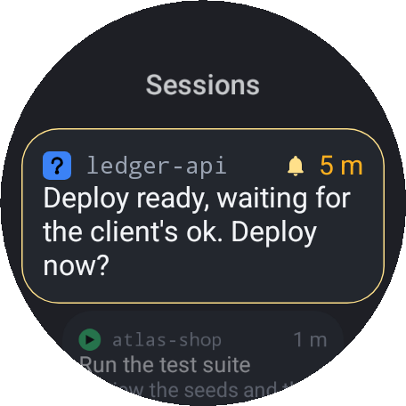
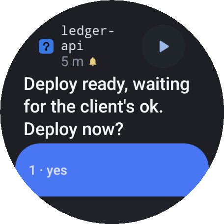
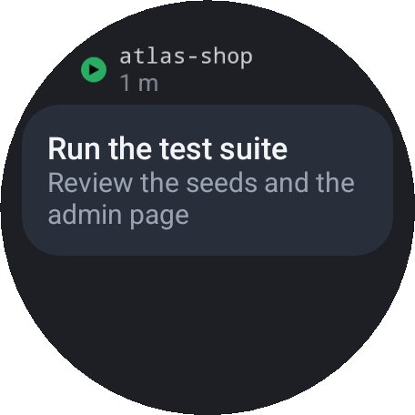
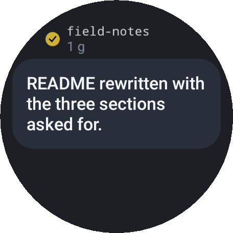
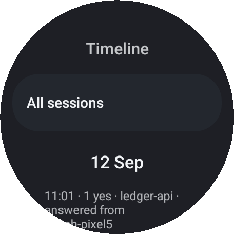
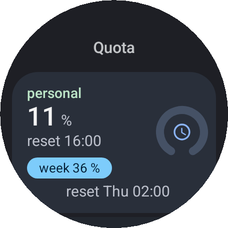
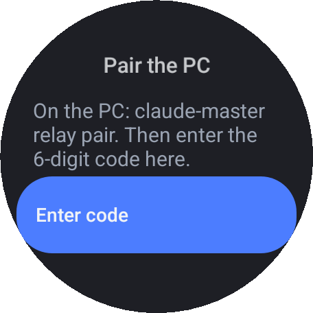
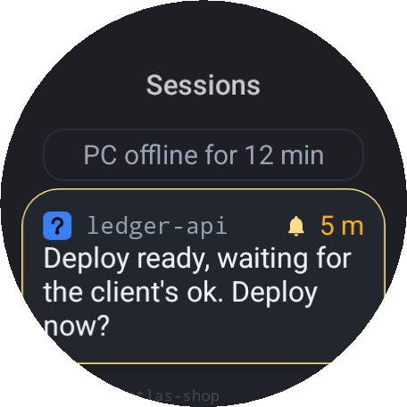
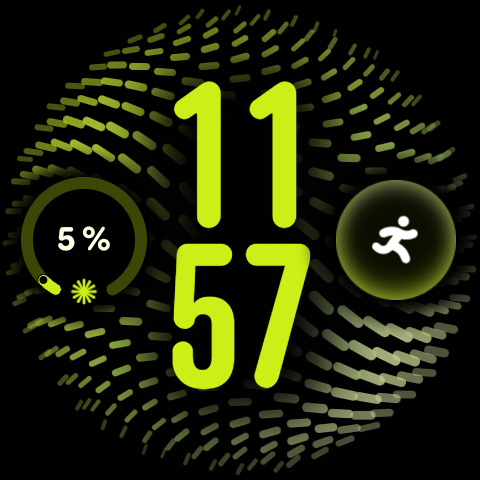
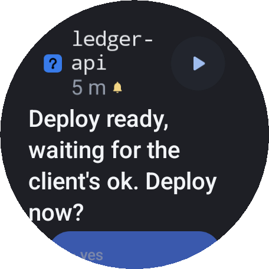

# claude-master-watch

  


**The Claude Code sessions of your computer, on your Wear OS watch.** The one waiting
for an answer comes first: read its question, tap an option or dictate a reply, and the
session goes on. See what the others are doing, follow one, launch a project, check the
quota, all without going back to the desk.

## It needs claude-master on your PC

This app is the wrist of [**claude-master**](https://github.com/frsorrentino/claude-master),
the Claude Code plugin that runs many sessions on one machine: one tab per project, one list
of what is running, prompts from one session to another, restore after a reboot. The app
shows what the plugin knows and sends back what you decide; without the plugin there is
nothing to show.

```bash
claude plugin marketplace add frsorrentino/claude-master
claude plugin install claude-master@claude-master-dev --scope user
claude-master init --yes --shim --shell
```

The full quickstart, and everything the plugin does from the terminal, is in
[its README](https://github.com/frsorrentino/claude-master#quickstart).

**No Wear OS watch?** claude-master works without this app. Its
[Telegram bot](https://github.com/frsorrentino/claude-master#from-telegram) is written for a
watch: short messages, one-tap answers, dictated prompts, on any phone, iPhone included.
On an Apple Watch it arrives as Telegram notifications with dictation (not yet verified on
real hardware).

## Screens

<table>
  <tr>
    <td align="center"><br>Sessions</td>
    <td align="center"><br>Question</td>
    <td align="center"><br>Working session</td>
  </tr>
  <tr>
    <td align="center"><br>Outcome</td>
    <td align="center"><br>Timeline</td>
    <td align="center"><br>Quota</td>
  </tr>
  <tr>
    <td align="center"><br>Pairing</td>
    <td align="center"><br>Stale data</td>
    <td align="center"><br>Complication</td>
  </tr>
</table>

App screens are rendered from the app's code by the Paparazzi snapshot tests, on the demo set
of `contract/` (no real project, path or account). The complication is photographed on a
Pixel Watch 5. Texts grow with the system font size and are read by TalkBack:

<p align="center"></p>

## What it does

- **Sessions**: every session of every account, the one waiting for you first, each with the
  badge of its terminal tab. A closed session reopens in its conversation from its row.
- **Questions**: full screen, options as wide buttons; «Write» for a free-text answer,
  «Chat about this» to talk it over first. Questions of high importance get a red border.
- **Session card**: what it is doing and the next step, or its outcome in full; the whole
  answer in paragraphs above the terminal tail; «Write» sends it a new prompt.
- **Read aloud**: ▶ next to every long text reads it with the system voice, block by block,
  and keeps going with the screen off.
- **Follow**: a long press on a session buzzes you when it finishes.
- **Launch**: start a project from the list the PC publishes; the terminal tab opens on the
  desktop too.
- **Tile**: the session in focus with its latest step, and the quota bars when there is room.
- **Complication**: the quota ring with the percentage and its window, 5h or 7d; when the
  5-hour window is empty the ring shows the week.
- **Notifications**: one conversation per session, the first options as direct actions, reply
  with choices or dictation; a question answered elsewhere closes on the wrist.
- **Also**: the timeline of the day, the 20:00 recap (read aloud too), the night queue.

## How it connects


There is no server of ours in between. The relay (`claude-master relay`, part of the plugin)
publishes the state of your sessions to **your own** Firebase project and runs the commands
the watch sends: answers, prompts, launches, reopenings. Every document is encrypted end to
end with AES-256-GCM; the key is agreed at pairing over X25519 and lives in the watch's
Keystore. Firebase sees blobs, never your prompts or your project names.

## Set up

1. **The plugin** on your PC: see above.
2. **Firebase**: a project with Realtime Database and Cloud Messaging, and the relay set up
   on it: [Relay for the Wear OS app](https://github.com/frsorrentino/claude-master#relay-for-the-wear-os-app)
   in the plugin's README (service account, rules, `relay install`).
3. **The app**: there is no store build yet. In the same Firebase project add an Android app
   with package `it.pixelbox.cmwatch`, put its `google-services.json` in `wear/`, then

   ```bash
   ./gradlew :wear:assembleDebug
   adb connect <watch-ip>:<port>        # Wear OS: Developer options → Wireless debugging
   adb install -r wear/build/outputs/apk/debug/wear-debug.apk
   ```

   Keep one signing key: switching between debug and release builds means uninstalling,
   and pairing again.
4. **Pair**: on the PC `claude-master relay pair` shows a 6-digit code; enter it on the watch.
   To try the app without a PC first: Settings → Demo.

## Status

Beta, in daily use on a Pixel Watch 5 (45 mm, Wear OS 7); minSdk 33 (Wear OS 4). Built
with Kotlin, Compose for Wear OS Material 3, ProtoLayout for the tile, Room, Firebase.

Design: [`docs/plans/2026-09-12-app-polso-design.md`](docs/plans/2026-09-12-app-polso-design.md)
(Italian). Contract with the PC: [`contract/`](contract/): the JSON fixtures the app's tests
read and the relay produces, byte for byte.
