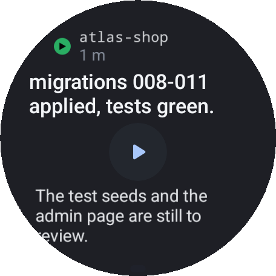

# claude-master-watch

Wear OS companion for [claude-master](https://github.com/frsorrentino/claude-master): the
Claude Code sessions of your machine on your wrist — the one waiting for an answer first.

<table>
  <tr>
    <td align="center"> Sessions</td>
    <td align="center"> Question</td>
    <td align="center"> Session</td>
  </tr>
  <tr>
    <td align="center"> Outcome</td>
    <td align="center"> Quota</td>
    <td align="center"> Complication</td>
  </tr>
</table>

App screens are rendered from the app's code by the Paparazzi snapshot tests, on the demo set of
`contract/` (in English). The complication is photographed on a Pixel Watch 5.

- **Tile**: the session in focus with what it is doing and, under a running tool, its latest step;
  three lines and the quota bar, or two lines and two bars (5 hours and week) when the text leaves
  room. Room decides, not a threshold.
- **Complication**: the quota ring with the app symbol and the percentage; short and long text with
  the sessions waiting or working.
- **Notifications**: one conversation per session, the first two options as direct actions, reply
  with choices or dictation, the question closed on the wrist when it is answered elsewhere.
- **App**: sessions of every account, the session card, the question full screen with wide buttons,
  the outcome read aloud on demand, the terminal tail, the timeline, launch, follow, the quota
  cards, the day's recap, the night queue. Margins follow the round screen, texts are read by
  TalkBack and grow with the system font size.
- **Transport**: Firebase RTDB + FCM behind a `Transport` interface, every document an end-to-end
  encrypted blob; the PC side is `cm-relay.py` in the claude-master plugin.

Design: `docs/plans/2026-09-12-app-polso-design.md`. Contract with the PC: `contract/`.
Target: Pixel Watch 5 (45 mm), Wear OS 7, minSdk 33.
